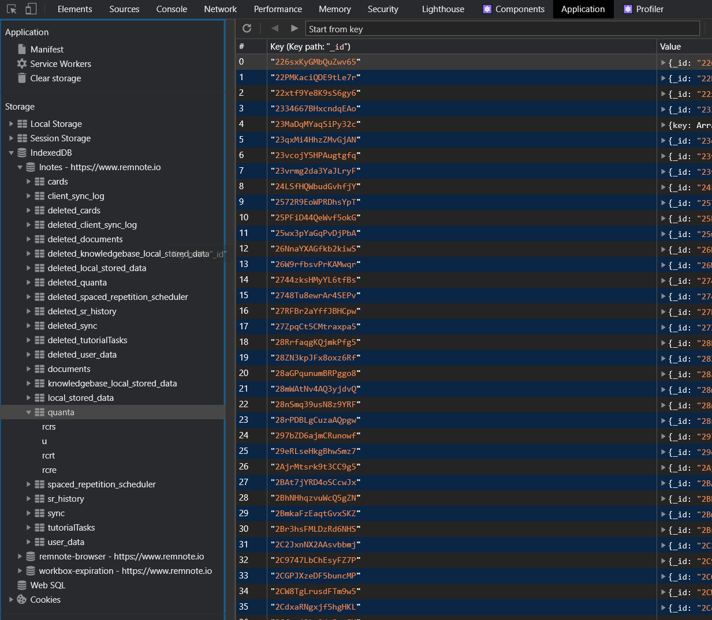
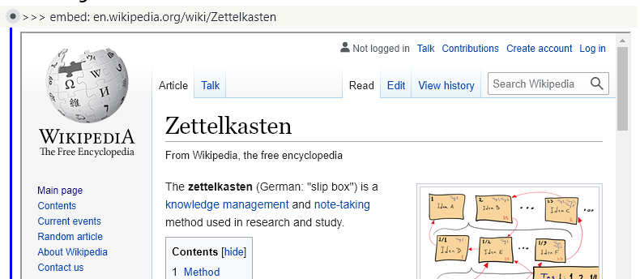

# ⚙ Smart Rem

**Note:** This is not yet stable and user friendly.
Everything can change and break.
For example I might want to change the way smart rems are identified and use tags instead of >>> in the future.
Use only to play around with and be amazed not to build permanent notes with yet :D

## How to try it

Run it directly in DevTools of a Chrome browser or the Desktop App:

- Press F12 (or Alt, Ctrl + Shift + I on Desktop)
- Goto Sources > Snippets
- Make a new Snippet
- Paste the code from `smart-rem.js`
  - Make sure that the line `db = await idb.openDB("lnotes", 24);` contains your actual database (`lnotes` in this case). If not, replace it with the correct one.
  - You can find the correct database by going to Application > Storage > IndexedDB and looking for the database with a quanta store which has many entries. (IDK if this is also the case on the Desktop app). 
- Execute with Ctrl + Enter.
  - You have to reexecute every time you refresh the page or restart the app and want to use smart rem.

Note: You have to reexecute the snippet each time you refresh the page and want use smart rems.

## Available Smart Rem

Demo Video:

[](https://youtu.be/w-PTWYbygdE)

**TODO:** Add all with example incovation, screenshot, possible caveats and maybe roadmap.

Paste examples _without formatting_ (Ctrl + Shift + V)

### Embed

```
>>> embed: en.wikipedia.org/wiki/Zettelkasten

>>> embed: www.connectedpapers.com/main/fe7897140f10ae5a949bcee97076d76c6ba7c070/As-we-may-think/graph
```



**Note:** There are only very few sites which let themselves be embedded. Many sites (youtube, pdfs from cloud storage) require generating a special embed url for example. Wikimedia sites should work.

# Vision - Smart Rem making you ... smart?

Smart Rem interpret the content of a rem/bullet point. Think Jupyther notebook, but for your knowledge base.
Like an algorithm running in your second brain.

**What Smart Rem can (will be able to) do:**

- Fetch and information from other services and APIs
  - Embed documents
  - Plain Data: Weather, Stocks, Speadsheet values
  - Collective Knowledge of Mankind: Wikidata/Wikipedia
- Search, aggretate and process information from your knowledge base
  - Queries
  - Make suggestions (e.g. when feeling sad suggest an activity that improved your mood in the past)
- Control center/automation for other digital systems
  - Order food, start your IoT coffee machine and control your smart home directly from your daily template
  - Make an appointment through a smart assistant
- Augment documents/rem (Smart Views)
  - % completed for a todo list
  - number of new/learned/due cards
  - Show slots for a template e.g. author, rating on a otherwise collapse book
  - Make a table for instances of a template
  - Create presentations from an outline
- Create (interactive) UI elements
  - Concept maps using Hermaid diagrams
  - Sliders, Buttons, ...
- [Transform Thoughts into a different form](https://vimeo.com/115154289)
  - graph
  - mindmap
- Execute Algorithms for Thought (ITE)
- Help you learn complex topics (ILE)

## Integrated Thinking Environment (ITE)

The human brain is [Exceptionally](https://en.wikipedia.org/wiki/List_of_cognitive_biases). [Bad](https://en.wikipedia.org/wiki/List_of_fallacies). at rational thinking. There is a [whole movement](https://www.lesswrong.com/) practicing to think better.

What if you could make rational decisions or be creative with the press of a button? (Disclamer: This is an exaggeration. :p)

> Algorithmic thinking is a way of getting to a solution through the clear definition of the steps needed – nothing happens by magic.

_Algorithms for Thought_ transform a passive writing medium into an active one that replies to your thoughts and helps you develop them, a medium/second brain/artificial mind that has conversations with you, guiding you through your thinking process, pointing out your mistakes and maybe even adapting to your mood ("Sir, take a deep breath."
― J.A.R.V.I.S. to Iron Man).

### How to solve this?

You can combat biases and bad thinking habits (like getting attached to the first resonalbe idea instead of thinking about all possibilities first) by sticking to a systematic thinking routine.

You can foster creativity by prompting your brain to make associations leading it deliberately and systematically to previously unexplored spaces (ABC lists, incremental reading).

You basically have a REPL, you engage in a dialog with your second brain asking you socratic questions to explore an idea.

### Algorithms for Thought

Basics:

- Min thinking time pomodoros

Algorithms:

- Decision Making (pro/con)
- De Bonos Algorithms
  - CAF: Consider All Factors
  - APC: Alternatives, Possibilities, Choices
  - OPV: Other People's Views
  - CnS: Consequence and Sequel
  - PMI: Plus, Minus and Interesting
- (repeated) ABC lists for creativity

Other Examples:

- Sentiment Analysis of a `#Mood` block and suggest activity hat helped improve your mood in the past `#Activity #MoodImprovement`

<!-- - Resourface connections with Smart Notes/Incremental Reading -->

Already existing principles in various tools/philosophies:

- Conversation with your past self in Zettelkasten as your thinking partner
- Queries
- RemNote Templates as static Algorithms
- SmartBlocks (see [below](#wait-havent-ive-seen-this-before))

<!-- Working memory (compressed, abstracted chunks of complex ideas) and internalized knowledge (creativity works only for learned knowledge, i.e the associations you can make and for written links) is important for thinking
  Spaced repetition to internalize

I explore CogAugSystems from a descision making angle as algorithms for thought smart rems guide you through a thinking process to combat cognitive biases.
Also true creativity required memory, i.e. spaced repetition or resurfacing connections with incremenral reading/smart notes -->

### More about Algorithms for Thought:

- [Algorithm for Thought Articles on CortexFutura](https://www.cortexfutura.com/c/algorithm-of-thought/) by Lukas Kawerau
- [Brain Friendly Thinking](https://www.youtube.com/channel/UCdk0x2XlLQZMzj7XrgJNdEw): Youtube Channel by Martin ? showing (among other things) methods popularized by Vera Birkenbihl (ABC list, KaWa)
- [Articles on Zsolt Viczián's Blog](https://www.zsolt.blog/search/label/Algorithms%20of%20Thought) describing algorithms by Edward De Bono
- [LessWrong: How To Fermi Model](https://www.lesswrong.com/posts/yTxHnfoD3L8CdezcG/how-to-fermi-model) this would be a pretty advanced algorithm to model
- [Thoughts on general Cognition Automation Software](https://www.youtube.com/watch?v=eH3mOKF5QUg) by Moritz Wallawitsch

## Integrated Learning Environment (ILE)

Get learning material injected right into your thinking medium/second brain, explore it interactively and internalize.

- Get definitions for concepts from Wikipedia/Wikidata or translate rems
- Adaptive Learning Experience
  - Get more explanations/flashcards for things you don't know yet
  - Integrated exercises and tests
  - Adaptive hints
  <!-- Example:
      - Calculator >>>1+2 check if it contains a plus
- Get further information
  - Embed wikipedia
- Chose to go easier or harder
  - See also arbitral for having easier or harder learning paths
- List exercises with copy button
- Learn anything learning paths
- Collaboration to create some teaching material?
  -->
- Learn from any resource and get communtiy made flashcards for that resource (hypothes.is for flashcards)
<!-- - Copy flash cards
    - Have a set of essential flash cards prepared
    - Edit them or add own information
    - Create flash cards every time you get stuck or make a mistake
    - Tag exercises you want to repeat -->

```

>>> learn: youtube.com/video
[Video Embed]
Community Created Flashcards:
- Front:: Back  [Button: Insert]
- Another:: One [Button: Insert]
```

- Follow a learning paths e.g. from [learn-anything.xyz](https://learn-anything.xyz/):
  - embed resources (wikipedia articles, youtube videos) into RemNote
  - take notes on them
  - make flash cards

### Super basic example

```
- >>> learn: math.geometry
  | Test question: What is the circumference of this rectangle
  |     4
  |  +----+
  | 2|    |
  |  |    |
  |  +----+
  - Answer: 8
- >>>
  | Sorry, that is not correct.
  |
  | Here is the definition of circumference: 2 * a + 2 * b
  |
  | Flash Card [Copy]
  |   - How is the circumference c of a rectangle with sides
  |     a and b calculated?:: c = 2*a + 2*b
  - Answer: 2 * 2 + 2 * 4 = 32
- >>>
  | A common mistake is to do + before *
  | Here is how it's done ...
```

This is related to [Explorable Explanations](https://explorabl.es/) pioneered by [Nicky Case](https://ncase.me/):

- [How to Remember Anything Forever-ish](https://ncase.me/remember/)
- [Visualizing Quaternions](https://eater.net/quaternions) by Grant Sanderson and Ben Eater.

Interactive Teaching and Practice Envrionments

- freecodecamp.org
- Khan Academy

How awesome would it be if you learn while essentially playing an interactive game and from time to time make a flash card...

## Wait, haven't I've seen this before?

Yes, Smart Rem is comparable to Roam Research's [Smart Blocks](https://roamresearch.com/#/app/roamhacker/page/GH0401tnt) by RoamHacker

> SmartBlocks adding a new dimension to Roam, making it a
> programmable note-taking tool for networked thought.

And I was obviously inspired by it: Some ideas are/will be borrowed because they are just too good (e.g. ability to no-code define smart blocks directly in your knowledge graph (!) and obviously - in lack of a better idea - the name), some things will be different (Interactivity/REPL).

Smart Rems was born because of the limitations of RemNotes Plugin system. I wanted to

- iterate all rem of a knowledge graph
- access card and practice data
- embed things like svgs and being able to click on them without being restricted by the Iframe sandbox
- add content automatically without the user invoking a plugin each time
- having a short feedback loop to build queries etc.

Smart Rem is different from SmartBlocks in a few aspects:

**Smartness Definition:**

- SmartBlocks are stored/edited directly in your knowledge base. If is no-code/low-code which allows even non-programmers to define them.
- Smart Rem are plain JavaScript code outside your knowledge base at the moment, but not necessarily forever.
  - The idea is to share them through RemNote Library at some point.

**Result placement and form:**

- SmartBlocks evaluates a definition and inserts the result into blocks.
  - This way it can access native features like queries.
- Smart Rem results are live generated and separate from you knowledge base.
  - This means you usually can not reference a result.
  - But also that a result is intended to be more than what the outline editor can display.
  - If applicable for a Smart Rem it can define content to copy over/insert with the click of a button/shortcut.

**Evaluation Time:**

- SmartBlocks are triggered manually and the result is evaluated evaluated at insertion time.
- Smart Rem are invoked automatically once a condition is met and the evaluation is repeated each time you open the page/or when a special event is emitted.
  - This means that state, if necessary, has to be set explicitly.
  - And also that changes in your knowledge graph could propagate automatically (e.g. for a mindmap of a subtree).

**Maturity:**

- SmartBlocks is usable and has quite a lot of cool features.
- Smart Rem is barely 1k lines of code and is just a proof of concept. It is not stable at all!

**Philosopy/Vision:** (I'm not confident in the correctness of this part!) This probably mirrors the philosophy of RemNote and RoamResearch.

- SmartBlocks (I think?) trys to automate note-taking with dynamic templates and guide thinking with Algorithms for Thought.
- RemNote's vision is _"to help increase and develop of knowledge in society and thereby drive scientific advancement forward by building tools to help humans learn and think."_ In accordance with this an [integrated learning experience](#integrated-learning-environment-ile) and knowledge exploration will play a big role in Smart Rem.

## Other Things

- [Arbital](https://www.lesswrong.com/posts/kAgJJa3HLSZxsuSrf/arbital-postmortem) A platform for finding, reading, and creating crowdsourced, intuitive explanations for ~~everything~~ math.
  - Superpowered wiki for explanations.
- [Khan Academy](https://www.khanacademy.org/math)
- [Better Explained](https://betterexplained.com/)
